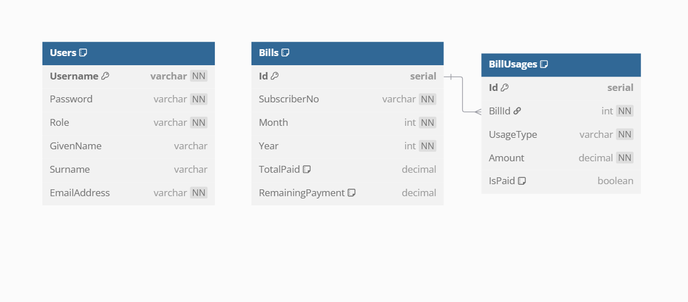

#  MobileProviderAPI

A RESTful Web API built with **ASP.NET Core 8.0**, **PostgreSQL**, and **Entity Framework Core** that simulates a mobile service provider's billing system. It supports adding usage, calculating monthly bills (with business logic for phone and internet charges), querying bills, and making payments. The API also uses **JWT-based authentication** and supports **pagination** in detailed billing queries.

 My deployed instance on Render that you can test with [Swagger](https://mobileproviderapi.onrender.com/swagger/index.html)

---
##  Assumptions

-  Bill won't be calculated untill someone uses the Calculate Bill endpoint.
-  Query Bill endpoint will only return the remaining amount that is not paid
-  Query Bill Detailed endpoint will return the total bill, remaining bill, phone and internet breakdown with paging, and will also return subscriber no, month and year, because details.
-  Pay Bill will pay the current amount of the bill, if a usage gets added after the bill was paid it will be marked as not payed for that month until another payment is made (this just pays the remaining value)  
-  Months are represented as integer like 1 for january, 2 for february, 3 for march and so on.
-  If a bill is fully paid (remainingPayment = 0) and new usage is added, that bill's remainingPayment and totalBill is updated according to the new usage.

---


##  Issues Encountered
-  Paybill and CalculateBill were not generating and overwriting existing bills properly, for example if I had a bill of 50$ and a payment was made setting the totalPaid to 50$ then I added another usage and Calculated the bill, the totalPaid was set to 0$.
-  After the previous issue was fix another problem arised, if I calculated the bill again it would always have the 50$ base internet fee as remaining, and after that was fixed the base 50$ fee would alway be marked as paid an would overwrite a bill if the bill was calculated two times.
-  The dockerfile written for deployment was fixed a few times until it could be deployed.
---

##  My ER Diagram



---
##  Features

-  **Add Usage**: Phone or Internet usage data per subscriber  
-  **Calculate Bills**: Monthly bill generation with custom fee logic  
-  **Query Bills**: View total or detailed usage and billing  
-  **JWT Authentication**: Secured access to protected endpoints  
-  **Bill Payment**: Mark bills as paid, remaining balance is updated when  
-  **Swagger UI**: API testing and documentation interface  
-  **PostgreSQL**: Relational database support  
-  **Deployed on Render**: Containerized deployment on Render.com  

---

## Billing Logic

### Internet Usage
- **Base Fee**: $50/month  
- **Extra Charges**: Every additional 10GB over 20GB = +$10  

### Phone Usage
- **Free Tier**: First 1000 minutes are free  
- **Extra Charges**: Every 1000 minutes beyond that = +$10  

---

## Authentication

Uses **JWT Bearer Token**. Token generation via `/api/v1/Login` endpoint using predefined or database users.

```json
{
  "username": "admin",
  "password": "password"
}
```


---

## Technologies Used

- ASP.NET Core 8.0  
- Entity Framework Core  
- PostgreSQL  
- JWT Authentication  
- Swagger  
- Docker + Render  

---

## Getting Started

### 1. Clone the Repository

```bash
git clone https://github.com/Sehrank8/MobileProviderAPI.git
cd MobileProviderAPI
```

### 2. Set Up PostgreSQL

Make sure PostgreSQL is running. Create a database named `mobileprovider` (or any other name just make sure you change the connection string).

### 3. Set Connection String

In `appsettings.json`:

```json
"ConnectionStrings": {
  "DefaultConnection": "Host=localhost;Port=5432;Database=YOURDATABASENAME;Username=<YOUR-USERNAME>;Password=YOURPASSWORD"
}
```

Alternatively, use secrets or environment variables in production.

### 4. Run Migrations

```bash
dotnet ef database update
```

### 5. Run the API

```bash
dotnet run
```

Navigate to: `http://localhost:8080/swagger`


---

## 🌍 Deployment (Render)

1. Push your code to GitHub  
2. Go to [Render.com](https://render.com)  
3. Create a new Web Service  
4. Link your GitHub repo  
5. Use:
   - **Build Command**: `dotnet publish -c Release -o out`
   - **Start Command**: `dotnet MobileProviderAPI.dll`  
6. Set environment variables:
   - `Jwt__Key`, `Jwt__Issuer`, `Jwt__Audience`
   - `ConnectionStrings__DefaultConnection`

---

## 📬 API Endpoints

| Endpoint                             | Method | Auth | Description                          |
|--------------------------------------|--------|------|--------------------------------------|
| `/api/v1/Login`                      | POST   | ❌   | Get JWT token                        |
| `/api/v1/Bill/add-usage`            | POST   | ✅   | Add phone/internet usage             |
| `/api/v1/Bill/calculate-bill`       | POST   | ✅   | Recalculate bill for a subscriber    |
| `/api/v1/Bill/query-bill`           | GET    | ❌   | Get total remaining and status       |
| `/api/v1/Bill/query-bill-detailed`  | GET    | ✅   | Paginated detailed usage breakdown   |
| `/api/v1/Bill/pay-bill`             | POST   | ❌   | Pay the current month's bill         |

---

## 📁 Project Structure

```
MobileProviderAPI/
├── Context/              → EntityFramework DbContext
├── Controllers/          → API Controllers
├── Data/
│   ├── Db/               → Data access logic
│   └── Svc/              → Business logic (Services)
├── Model/                → Models & DTOs
├── Program.cs            → App startup
├── appsettings.json      → Configs
└── Dockerfile            → Deployment config
```

